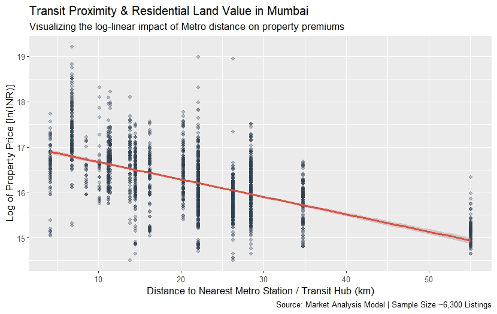

# Capitalizing Mass Transit: A Hedonic Approach to Land Value Capture in Mumbai

**📌 Project Overview**

Public investment in high-capacity urban transit systems—such as the Mumbai Metro—creates substantial positive externalities, reshaping the spatial economy of the surrounding metropolis. This research project applies **Rosen’s (1974) Hedonic Pricing Theory** and **Alonso's Bid-Rent Framework** to evaluate the spatial capitalization effects of mass transit nodes across the Mumbai Metropolitan Region (MMR). 

By isolating the consumer's pure marginal willingness-to-pay for transit proximity alongside structural controls, this study generates empirical baselines to inform market-driven urban planning interventions. Rather than focusing on traditional tax-based extraction, the findings provide structural justification for modern land-use policies. These include **Transit-Oriented Development (TOD) via Inclusionary Density Bonuses**, and lowering entry-level housing costs by **De-bundling Automobile Infrastructure** in transit corridors amongst others.

**📊 Understanding the Results**

The log-linear multiple regression model demonstrates exceptional explanatory power, achieving an Adjusted R-squared of 0.8192 across 2,656 real estate transactions. This means our model accounts for 81.92% of the total variance in Mumbai housing prices.

* Distance_to_Metro: For every additional kilometer a property sits away from a Metro station, its market value drops by exactly 3.31%. This proves a massive consumer willingness-to-pay for transit connectivity.
* No. of Bedrooms: Keeping absolute square footage identical, adding an extra bedroom into the floor plan yields a 33.89% price premium, reflecting intense demand for internal space optimization.
* New/Resale: Brand-new primary market launches command a 9.73% premium relative to older secondary-market resale units.
* Amenity_Score: Auxiliary building facilities (gyms, clubhouses) are statistically insignificant once core location, size, and layout density are controlled.

Here is the exact econometric output generated in RStudio from our sample size of 2,656 residential transactions ($n = 2,656$):

```r
Call:
lm(formula = log(Price) ~ Area + `No. of Bedrooms` + `New/Resale` + 
    Amenity_Score + Distance_to_Metro, data = final_policy_data)

Residuals:
     Min       1Q   Median       3Q      Max 
-1.38229 -0.17039  0.00763  0.17968  1.76949 

Coefficients:
                    Estimate Std. Error t value Pr(>|t|)    
(Intercept)        1.585e+01  2.014e-02 786.879   <2e-16 ***
Area               3.959e-04  1.874e-05  21.128   <2e-16 ***
`No. of Bedrooms`  3.389e-01  1.164e-02  29.127   <2e-16 ***
`New/Resale`       9.734e-02  1.203e-02   8.091 8.95e-16 ***
Amenity_Score     -1.746e-03  1.758e-03  -0.993    0.321    
Distance_to_Metro -3.314e-02  5.514e-04 -60.105   <2e-16 ***
---
Signif. codes:  0 ‘***’ 0.001 ‘**’ 0.01 ‘*’ 0.05 ‘.’ 0.1 ‘ ’ 1

Residual standard error: 0.2882 on 2650 degrees of freedom
Multiple R-squared:  0.8196,	Adjusted R-squared:  0.8192 
F-statistic:  2408 on 5 and 2650 DF,  p-value: < 2.2e-16
```


**📈 Visualizing the Results**

The spatial gradient plot below displays how property premiums decay systematically as a function of distance from the nearest transit hub. The downward slope represents our statistically significant 3.31% price drop per kilometer.




**🏛️ Policy Implications & Governance Frameworks**

The econometric proof of a 3.31% property premium decay per kilometer shifts the municipal governance toward innovative structural solutions:

**1. Inclusionary Zoning & Density Bonuses:**
The model identifies an immense 33.89% market premium for layout density (extra bedrooms). The Brihanmumbai Municipal Corporation (BMC) can grant private developers a Floor Space Index (FSI) "Density Bonus" within transit buffer zones on the strict condition that 20% of the augmented built area is designated for compact, affordable housing pools.

**2. Parking Maximums & De-bundled Housing Costs:**
Because the amenity factor is statistically insignificant, forcing developers to construct mandatory parking minimums introduces unnecessary structural costs. The city should transition to parking maximums and mandate "de-bundled" parking spaces—selling them separately from the residential carpet area so transit-reliant citizens aren't forced to subsidize automobile infrastructure.


**📚 References & Data Sources**

**1. Data Source:** [Shah, S. (2021). Mumbai Housing Dataset. Kaggle](Mumbai1.xslx) — Cross-sectional residential transaction records across the Mumbai Metropolitan Region (MMR), geocoded to absolute spatial coordinates ($n = 2,656$) to map transit proximity.

**2. Economic & Urban Planning Literature**

- [Alonso, W. (1964). Location and Land Use: Toward a General Theory of Land Rent. Harvard University Press.](William_Alonso_Location_and_Land_Use) (Theoretical foundation for transit distance decay and urban bid-rent curves).

- [Rosen, S. (1974). Hedonic Prices and Implicit Markets: Product Differentiation in Pure Competition. Journal of Political Economy, 82(1), 34-55.](Hedonic_Pricing_Rosen.pdf) (Methodological foundation for decomposing multi-attribute real estate assets).

**3. Institutional Policy Frameworks:** 
- [Ministry of Housing and Urban Affairs (MoHUA), Government of India. (2017). National Transit Oriented Development (TOD) Policy.](National_TOD_Policy.pdf) (Policy justification for integrating land use with rapid transit corridors).

- [Municipal Corporation of Greater Mumbai (MCGM). (2018). Mumbai Development Plan 2034 (DP 2034).](DCPR_2034_BMC.pdf) (Contextual baseline for Floor Space Index (FSI) and zoning limits in MMR).
